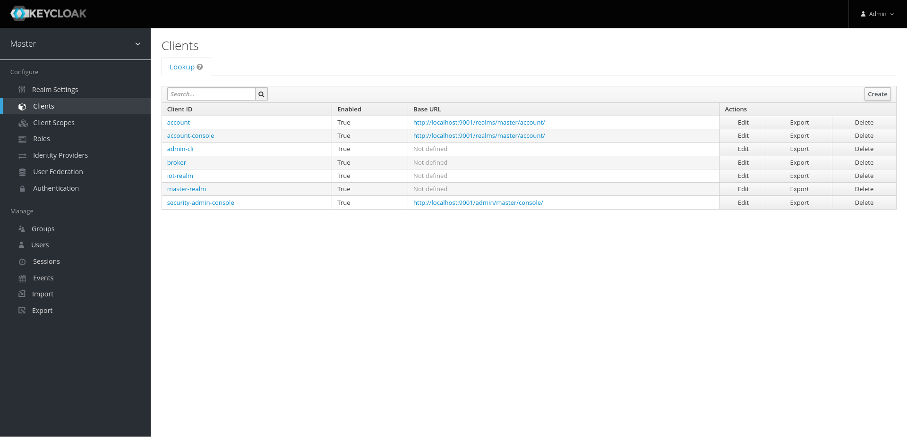

# Backend

---

### Requirements

Download and install [Docker Desktop](https://docs.docker.com/get-docker/).

---

### Getting started

1) Clone repository

2) In root of repository run script `./build-container.sh` and wait for an inscription `Build finished`

### Keycloak first setup

1) Go to the Keycloak on `localhost:9001`:


2) Go to the section `Administration Console`:


3) Sign in with username `admin` and password `admin`:


4) Go to the section `Master` and press `Add realm` button:


5) Name realm `iot`, press `Select file` button, choose from repository folder `keycloak/realmdata` file `realm-iot.json` and press `Create` button:


6) Go to the section `Iot` and choose `Master` section:


7) Go to the section `Clients`:



8) Press on `admin-cli`:


9) Choose `Access Type` and change from `public` to `confidential`, turn on `Service Accounts Enabled` and press `Save` button below:


10) Press on `Service Account Roles`:


11) Choose `Client Roles` and select `iot-realm`:


12) In `Available Roles` choose `manage-users`, `query-users`, `view-users` and press `Add selected >>`:


13) Press on `Credentials` and copy `Secret` value (or press `Regenerate Secret` button and then copy `Secret` value):


14) Go to the section `Master` and choose `Iot` section:


15) Go to the section `Clients`:


16) Press on `iot-rest-api`:


17) Press on `Credentials` and copy `Secret` value (or press `Regenerate Secret` button and then copy `Secret` value):


18) Close Keycloak

19) Stop and delete container in Docker Desktop and delete image `backend` (IMPORTANT!!!)


20) In repository folder `env.d` open file `backend` and paste saved secret into `KEYCLOAK_ADMIN_CLIENT_SECRET` and `KEYCLOAK_IOT_CLIENT_SECRET` variables:

```properties
# SOME ENVIROMENT VARIABLES 
# ...

KEYCLOAK_ADMIN_CLIENT_SECRET=<YOUR_SAVED_ADMIN_CLIENT_SECRET>
KEYCLOAK_IOT_CLIENT_SECRET=<YOUR_SAVED_IOT_CLIENT_SECRET>
```

21) In root of repository run script `./build-container.sh` and wait for an inscription `Build finished`

---

Now backend is must be ready for REST API requests (for detail information about backend API, read [API-DOC](./API-DOC.md)
